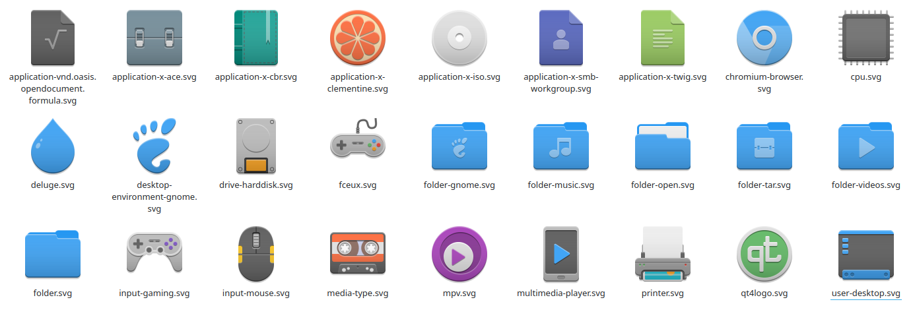

<div align="center">
    
    <h1>Newaita reborn</h1>
    <p>Remaster Newaita icon theme. Refreshed and made cleaner.</p>
    
</div>

## Installation

After downloading and extracting, move all the `Newaita-reborn` and `Newaita-reborn-dark` folders to:
- `/usr/share/icons` if you want them to be visible for all users.
- `~/.icons` on **GTK** or `~/.local/share/icons` on **KDE** if you want them to be visible only to your user.

### For Arch Linux users

```shell
# With Yay or another AUR helper of your choice
yay -S newaita-reborn-icons-git
```

Thanks to [Cahian Freire](https://github.com/cahian)

## Support

Even a small donation boosts motivation :)

[](https://www.paypal.me/cbrnix)
or
[](https://yoomoney.ru/to/41001796418567)
